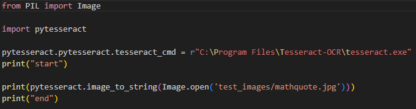
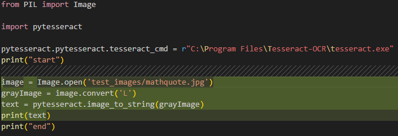
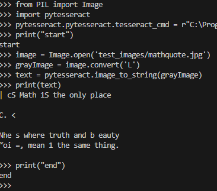
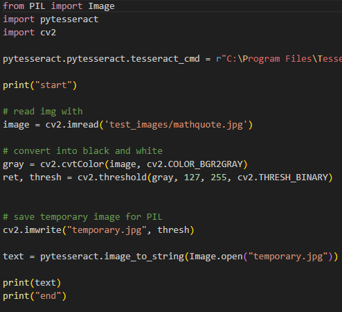
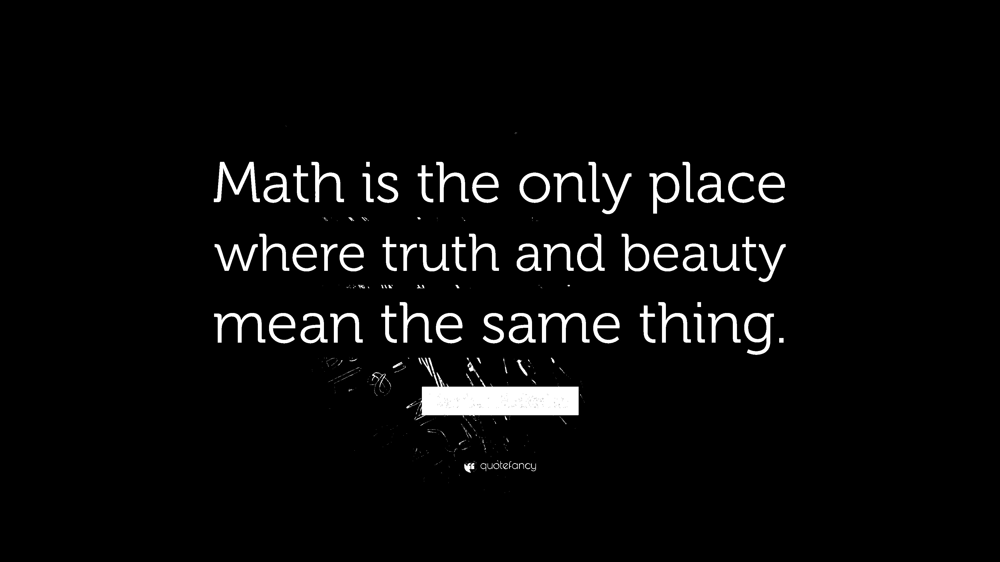
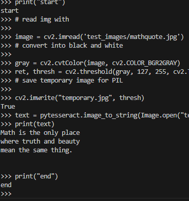

# Seminaarityön raportti

### Tässä seminaarityössä on tarkoitus tutkia pythonin tesseract kirjastoa, miten sitä käytetään ja tehdä työkalu, joka etsii tekstiä kuvasta tai kuvista tai pdf:stä.

## Ensimmäinen sessio:

### Lähdin kokeilemaan miten sen saa toimimaan. Aluksi en tajunnut miten se pitää asentaa. Luulin, että pip install tesseract riittänee, mutta sitten löysin, että pitää käydä lataamassa ja asentamassa paketti https://github.com/UB-Mannheim/tesseract/wiki sivulta.

### Löysin netistä math quote kuvan ja aattelin testata miten hyvin tesseract osaa lukea. Valitsemani kuva näyttää siltä, että se voi olla tosi hankalaa.
###  

### Ensimmäisellä yksinkertaisemmalla yrityksellä se ei lukenut mitään. start ja end oli sitä varten, että voisin nähdä tekeekö koodi mitään.
### 

### Toisessa yrityksessä oli jo tulosta. Siinä ennen kuvan lukemista muutin sen harmaisiin sävyihin. Tätä suositeltiin https://coderivers.org/blog/tesseract-python/ sivulla.
###  

### Koska toisessa yrityksessä ei tullut esille teksti halutulla tavalla, niin lähdin kokeilemaan sen saman sivuston toista suositusta eli muutin kuvan mustavalkoiseksi (binarization) ennen lukemista. Siihen piti käyttää uutta kirjastoa nimeltään cv2.
###    
### Tästä näkyy, että saatiin quote luettua hyvin, mutta sen sanonneen henkilön nimeä ei näy sillä alkuperäisessä kuvassa sen teksti ja tekstin tausta ovat tosi samansävyisiä. Tämä tulos vaikuttaa jo tosi hyvältä, koska kuva vaikuttaa tosi vaikealta koneelliseen lukemiseen.

## commitit järjestyksessä:

### mathquote test. doesnt show anything from the image yet

### shows most of the math quote with some additions from the background. after grayscaling

## Lähteet

### https://coderivers.org/blog/tesseract-python/

### https://pypi.org/project/pytesseract/

### https://github.com/UB-Mannheim/tesseract/wiki