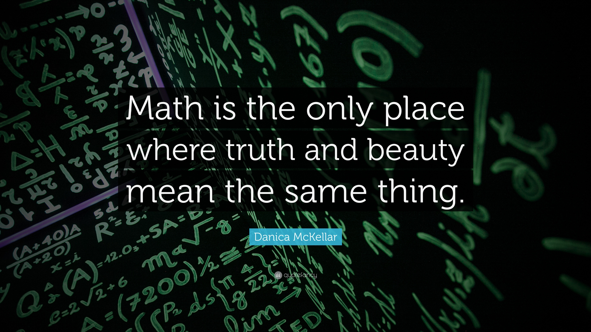
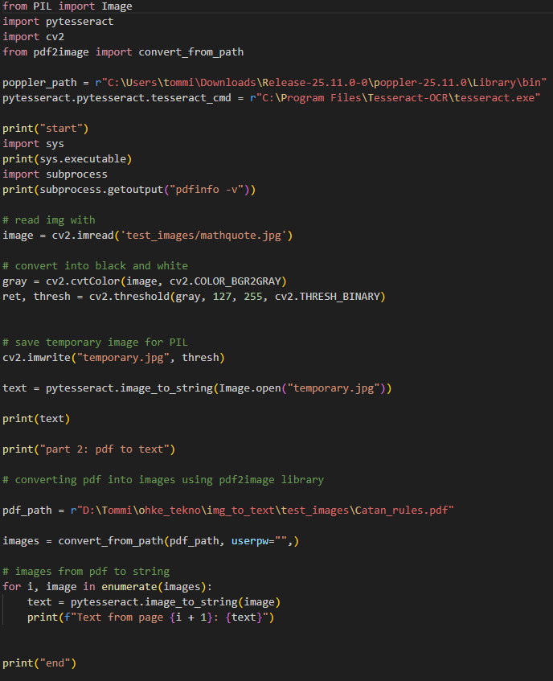
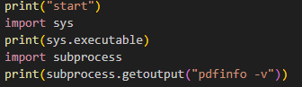
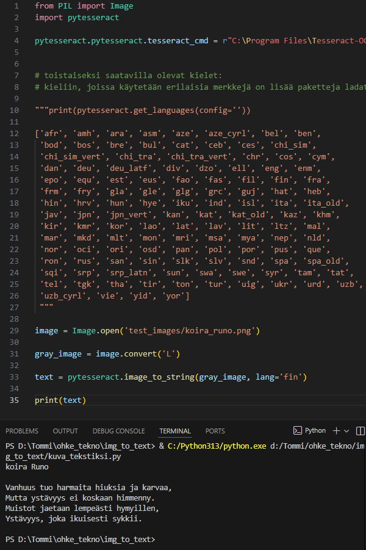

# Seminaarityön raportti

### Tässä seminaarityössä on tarkoitus tutkia pythonin tesseract kirjastoa, miten sitä käytetään ja tehdä työkalu, joka etsii tekstiä kuvasta tai kuvista tai pdf:stä.

## Ensimmäinen sessio:

### Lähdin kokeilemaan miten sen saa toimimaan. Aluksi en tajunnut miten se pitää asentaa. Luulin, että pip install tesseract riittänee, mutta sitten löysin, että pitää käydä lataamassa ja asentamassa paketti https://github.com/UB-Mannheim/tesseract/wiki sivulta.

### Löysin netistä math quote kuvan ja aattelin testata miten hyvin tesseract osaa lukea. Valitsemani kuva näyttää siltä, että se voi olla tosi hankalaa.
###  

### Ensimmäisellä yksinkertaisemmalla yrityksellä se ei lukenut mitään. start ja end oli sitä varten, että voisin nähdä tekeekö koodi mitään.
### 

### Toisessa yrityksessä oli jo tulosta. Siinä ennen kuvan lukemista muutin sen harmaisiin sävyihin. Tätä suositeltiin https://coderivers.org/blog/tesseract-python/ sivulla.
###  

### Koska toisessa yrityksessä ei tullut esille teksti halutulla tavalla, niin lähdin kokeilemaan sen saman sivuston toista suositusta eli muutin kuvan mustavalkoiseksi (binarization) ennen lukemista. Siihen piti käyttää uutta kirjastoa nimeltään cv2.
###    
### Tästä näkyy, että saatiin quote luettua hyvin, mutta sen sanonneen henkilön nimeä ei näy sillä alkuperäisessä kuvassa sen teksti ja tekstin tausta ovat tosi samansävyisiä. Tämä tulos vaikuttaa jo tosi hyvältä, koska kuva vaikuttaa tosi vaikealta koneelliseen lukemiseen.

## Toinen sessio:

### Tässä lähdin kokeilemaan pdf:stä lukemista tesseractilla. Sitä varten suositeltiin https://coderivers.org/blog/tesseract-python/ sivustolla käyttämään kirjastoa pdf2image, jotta saataisiin pdf kuviksi ja sitten lukemaan teksti kuvista. 

### 

### Tässä näkyy koodi, jolla sain lopulta sen toimimaan. https://pypi.org/project/pdf2image/ sivustolla sanottiin, että pdf2image käyttöön pitää asentaa poppler niminen kirjasto. Minulla oli jonkin aikaa ongelmia popplerin pathin kanssa. En itse aluksi ymmärtänyt miksi ei se lukenut pathia oikein. vaikka lisäsin sen myös käyttäjan path scripteihin. Päätin kysyä chatgpt:ltä apua. Se suositteli kokeilemaan koodia seuraavassa kuvassa:

### 

### Tämän avulla sain selville, että mun piti lisätä path sekä käyttäjan patheihin, että systemin patheihin.

### Ohjelma ei toiminut vielä. Sanoi ettei pysty lukemaan esimerkki pdf:ää. Valitti tällaisesta: I/O Error: Couldn't open file 'D:\Tommi\ohke_tekno\img_to_text<09>est_images\Catan_rules.pdf': No error. Sain tietää, että /t on pythonissa tab. Sitten tämä pdf path piti laittaa r"...." sisälle, jotta se lukisi sen oikein.

### Seuraava ongelma oli pdf:ssä itsessään. Latasin alunperin pdf:n, joka oli salattu. Kysyin chatgpt:ltä ja sanoi että kokeilisin syöttää tyhjän salasanan koodissa näkyvällä tavalla. Ei toiminnut ja päätin etsiä uuden esimerkki pdf:n. Tämän sain vihdoin näkymään. Tässä pdf:n lukemisessa kesti huomattavasti enemmän aikaa. Lopulta tulos ei ollut täysin tarkka, siinä oli pikku vikoja.

## Kolmas sessio:

### Halusin kokeilla myös miten tesseract lukee suomenkielistä tekstiä.

### Aika yksinkertaista: kieli pitää määritellä image_to_string funktiossa. 

### 

## commitit järjestyksessä:

### mathquote test. doesnt show anything from the image yet

### shows most of the math quote with some additions from the background. after grayscaling

### reads the quote well after making it black and white (binarizing) with cv2 library

### from pdf to img to string works but not fully accurate

### asioiden järjestelyä ja suomenkielisen tekstin lukeminen kuvasta

## Lähteet

### https://coderivers.org/blog/tesseract-python/

### https://pypi.org/project/pytesseract/

### https://github.com/UB-Mannheim/tesseract/wiki